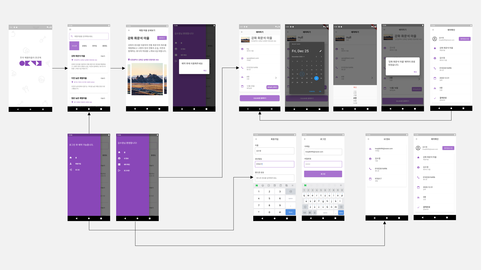

# 어디가지? 
## Where R U Going? 🚗🌳
> 임베디드소프트웨어응용 - 미니프로젝트   
> 전국 체험 마을 예약 어플리케이션

```

📌 언택드 관광의 이용률이 증가함에 따라 그에 따른 소비 형태에 걸맞는 어플리케이션입니다.

📌 6차 산업과 ICT를 연결하는 매개체의 역할로 원하는 체험 마을을 찾아 예약할 수 있습니다.

📌 전국의 체험 마을을 한눈에 볼 수 있는 편리한 서비스를 제공합니다.

```

## TEAM 소개
👩 김수정 - [suzumsz](https://github.com/suzumsz)    
👧 한송희 - [Hansongheee](https://github.com/Hansongheee)  
👦 문우석 - [sox375](https://github.com/sox375)  
👨 고승재 - [KoSeungJae-PF](https://github.com/KoSeungJae-PF)  

## 기능소개 
|  담당자  |   기능설명   |   구현여부   |                              
| :----------: | :----------------: | :----------: |
|김수정| 브랜딩, 디자인, 로그인/로그아웃, DB값 불러오기, 메인/패널화면 구현 | 🚗 |
|한송희| 로그인/내정보화면 구현 | 🌳 |
|문우석| 로그아웃, DB값 넘겨주기, 회원가입/예약하기/예약확인화면 구현 | 🚕 |
|고승재| DB연동, 애니메이션효과, 상세화면 구현 | 🌲 |

## Workflow



## 개발환경
      
 

## 참고
- 결과물 구동은 [시연동영상](/etc/임베디드소프트웨어응용_어디가지_실행화면.mp4) 참고  
- 어디가지 [최종보고서](/etc/임베디드소프트웨어응용_어디가지_결과보고서.hwp/) 참고  

